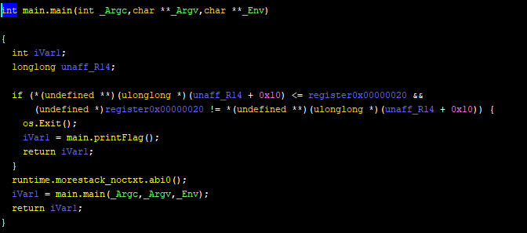
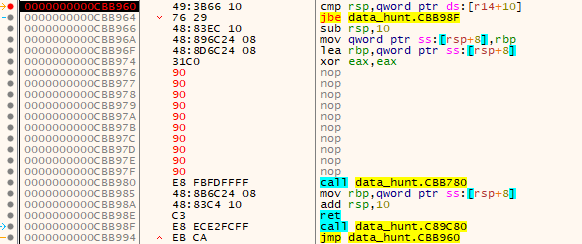

# Hahaha (Reversing)

## analysis
First, I put the binary in ghidra.  

### decompile

In `main.main` function, I found that `main.printFlag` function is called in if statement. But `os.Exit` function is called before that.

So, I opened the binary with x64dbg and overwrote the memory around calling `os.Exit` function with NOP. 

Then, I ran until stepping over `call main.printFlag` and got a flag `vishwaCTF{b1t_pl34s3!}`