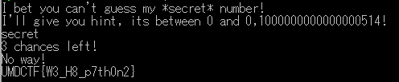

# Legacy

In this problem, we cannot receive any file. So I sent some strings.Then, I got some error message that shows below.

```
Traceback (most recent call last):
  File "/home/ctf/legacy.py", line 15, in <module>
    if (input(str(3-i) + " chances left! \n") == secret):
  File "<string>", line 0
  ```

  From these messages, it is became clear that python in running on the server and the input values are received with `input()`. In python2.x, `input()` has a vulnerability for accessing any valiables to just input name of target valiable. From above, we input "secret" to get the value of `secret`.



The flag is `UMDCTF{W3_H8_p7th0n2}`