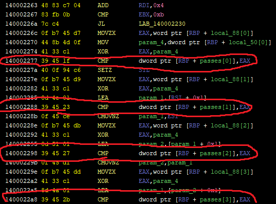

# Confusion

## problem
>Why is everything so Confusing in here? It is not difficult to bypass the anti-debugger but find the key, to get started, here's the Username: nLYTCmdXobFRhs you'll have to use your neurons.  
Flag Format: vishwaCTF{password_separated_by_underscores}

## overview
Run the program in command line. The program asked us to input "rules" or "continue". Input "continue", then program required the name and 11 password. So the flag format should be like: `vishwaCTF{1_2_3_4_5_6_7_8_9_10_11}`

## analysis
Put the binary in ghidra as always. 
First, we can find that there is no `main` function. To find out that, attaching x64dbg and using "step over" from entry point until stop. 

The program would stop with popup. At the time RIP pointed the address of `call 0x1300+base`. Therefore, we predict that `FUN_14001300` is `main` function. 

See the decompiled binary in ghidra. 

In `main` function, there is debugger detector and it presents a popup if a debugger is attached while runnning.   
After received user input, a function is called and I renamed it `after_continue`. (0x65756e69746e6f63 is hexadecimal representation for "continue")

In `after_continue` function, a debugger detector is at the top of the code. 

But, there is no detector after this point. So following procedure can be used to bypass the detector:  
1. Run the binary without a debugger.
2. input "continue".
3. attach x64dbg with that proccess.

After runnning detector, the program received name and passwords. Then, compare passwords with data on the stack which value depends on name.  
So now, attaching x64dbg following above steps, record the compared values. The instructions for comparing passwords are marked in the below image.

> So the flag format should be like: `vishwaCTF{1_2_3_4_5_6_7_8_9_10_11}`

Finally, aling the obtained passes to the above form.
The flag is `vishwaCTF{64_103_109_107_65_96_107_47_35_81_14}`