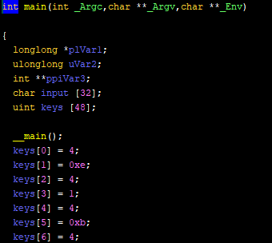
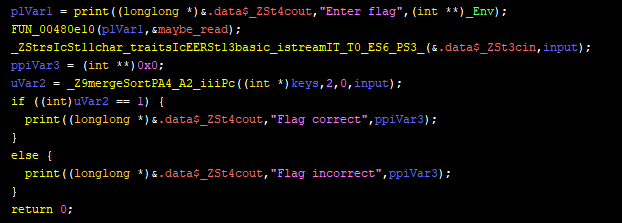

# Uzumaki

## Problem
This has something to do with "Uzumaki" remainder theorm and total no. of alphabets

## Analysis and Solution
First, put the binary in ghidra.  
In `main` function, int values are put into the stack. I named that variable as `keys`.

After that, the program print "Enter flag", and asked to input a flag.

From above, we can say that it is correct if return value of `_Z9mergeSortPA4_A2_iiiPc` function is 1. Follow this function. 

From the two upper image, arg1 and arg2 are hard coded as 2 and 0. So we don't have to care about if statement. As a result, this function return the value of `check_flag` function. (Actually, I have renamed this function's name but I forgot the original one. sry.) The arguments of `check_flag` are `keys` and our input.

In `check_flag` function, `input` is compared with `keys` values that are modified by the specific algorithm. In order to calculate the `keys` values, I implemented a solver ([Uzumaki.solver.py](Uzumaki_solver.py)) that work similar to `check_flag`. Run the solver, and get the flag `vishwactf{_1_@m_@_w33b_}`

